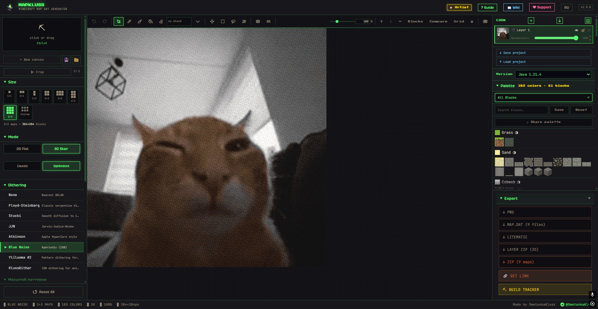

# MapKluss

[](https://github.com/SmetankaKluss/mapartforge/actions/workflows/deploy.yml)
[](https://mapkluss.art)
[](https://react.dev/)
[](LICENSE)

MapKluss is a browser-based Minecraft map art generator and editor. It converts images into 2D flat map art or 3D stair map art, lets you edit the result with artist tools, and exports files for Minecraft and Litematica.

Site: https://mapkluss.art
Author: https://github.com/SmetankaKluss



## Features

- Image to Minecraft map art conversion in the browser
- 2D flat mode and 3D stair mode
- Minecraft palette controls with version-aware block selection
- Dithering modes including KlussDither, Floyd-Steinberg, Stucki, Atkinson, Blue Noise, and Yliluoma
- Artist mode with layers, brush, fill, text, selections, undo and redo
- PNG, MAP.DAT, LITEMATIC, ZIP, material list, and showcase exports
- Build tracker for team projects
- Gallery / examples page with shareable example settings
- RU / EN interface

## Privacy

Normal image processing runs locally in the browser. Images are not uploaded for basic conversion, editing, or local export.

Supabase is used only for features that need online storage, such as share links and build tracker sessions. Those features require explicit user action.

## Development

```bash
npm install
npm run dev
```

Build check:

```bash
npx tsc -b --pretty false
npm run build
```

## Environment

Copy `.env.example` to `.env.local` if you need share links or build tracker locally:

```bash
VITE_SUPABASE_URL=
VITE_SUPABASE_ANON_KEY=
VITE_SHARE_BASE_URL=https://mapkluss.art
```

The app includes the public Supabase anon configuration used by the production site, so share links and build tracker sessions work in the default build. Override these variables only when using a different Supabase project.

## Project Structure

- `src/components` - React UI components
- `src/lib` - image processing, palettes, exports, storage helpers
- `src/workers` - Web Worker processing pipeline
- `public/examples` - curated gallery example assets
- `docs` - project notes, changelog, and post drafts

## Repository Notes

Generated screenshots, local tool state, exported `.litematic` files, `.dat` files, and local `.env` files are intentionally ignored. Keep public assets in `public/` and source assets in `src/assets/`.

## License

MIT. See [LICENSE](LICENSE).
