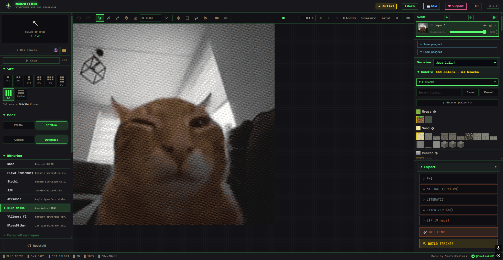

<div align="center">
  
  <h1>MapKluss</h1>
  <p><strong>Make Minecraft map art in your browser.</strong></p>
  <p>
    <a href="https://mapkluss.art">Open MapKluss</a> ·
    <a href="https://mapkluss.art/examples">See examples</a> ·
    <a href="https://t.me/SmetankaKluss">Telegram</a> ·
    <a href="https://boosty.to/klussforge">Support the project</a>
  </p>
</div>



MapKluss turns an image into a Minecraft map-art project you can actually build. Upload an image, tune the palette, fix the pixels that matter, then export the files and material list for your world or server.

It runs in the browser, is available in English and Russian, and does not make you install an editor just to try it.

## What it does

- Builds 2D Flat, 3D Stair and Two-layer map-art plans for current Minecraft versions
- Matches colours against Minecraft blocks with configurable palettes and dithering
- Includes a pixel editor with layers, selections, crop, undo, redo and editable text
- Shows 2D and 3D previews before anything is built in-game
- Exports PNG, Litematic, Schematic, MAP.DAT, structure files, materials and commands
- Keeps optional Cloud projects, favourites and build progress in one place
- Connects to the [MapKluss Companion](https://github.com/SmetankaKluss/mapkluss-companion) Fabric mod for library access, Lens previews, scanning and tracking

## Start here

Open [mapkluss.art](https://mapkluss.art), drop in an image and choose the map size and build mode. The editor works without an account. Sign in only when you want Cloud saves, cross-device projects or the Companion connection.

For a quick look at finished work, visit [Examples](https://mapkluss.art/examples). Bugs and ideas belong in [GitHub Issues](https://github.com/SmetankaKluss/mapartforge/issues). Security-sensitive reports should follow [SECURITY.md](SECURITY.md).

## Source tree

- `src/` contains the React editor and image-processing code.
- `public/` holds the website assets and published Companion downloads.
- `supabase/` contains the Cloud schema and Edge Functions used by the site.
- `deploy/` contains reproducible backup, monitoring and migration tooling.
- `docs/` contains public release notes and integration contracts.

The Companion is a separate Fabric project with its own source and releases: [SmetankaKluss/mapkluss-companion](https://github.com/SmetankaKluss/mapkluss-companion).

## Run it locally

This is useful when you want to contribute or run the editor from source. Install Node.js 22 or newer, then:

```bash
npm ci
npm run dev
```

Before opening a pull request, run:

```bash
npm test
npm run lint
npm run build
```

Configuration examples live in [`.env.example`](.env.example). Do not commit real credentials or local environment files. Contribution details are in [CONTRIBUTING.md](CONTRIBUTING.md).

## По-русски

MapKluss - браузерный редактор мап-артов для Minecraft. Загрузи картинку, настрой палитру и дизеринг, поправь отдельные пиксели и скачай готовый план строительства.

- Сайт: [mapkluss.art](https://mapkluss.art)
- Примеры: [mapkluss.art/examples](https://mapkluss.art/examples)
- Мод: [MapKluss Companion](https://github.com/SmetankaKluss/mapkluss-companion)
- Связь: [@SmetankaKluss](https://t.me/SmetankaKluss)
- Поддержка проекта: [Boosty](https://boosty.to/klussforge)

## License

MapKluss is available under the [MIT License](LICENSE).
